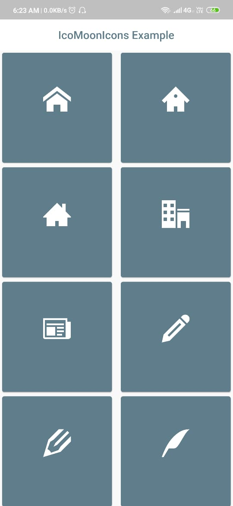

# flutter_icomoon_icons

## [See Catalog](https://erikflowers.github.io/weather-icons/)

facing any problems? have a look into the documentation (class IcoMoonIcons)

## 222 Weather Themed Icons for Flutter.

This flutter package allows you to use all of the IcoMoon package

Find it at at [pub.dartlang.org](https://pub.dev/packages/flutter_icomoon_icons)


## Installation

In the dependencies: section of your pubspec.yaml, add the following line:

`flutter_icomoon_icons: <latest_version>`

## Usage

```dart
import 'package:flutter_icomoon_icons/flutter_icomoon_icons.dart';

class MyAwesomeWidget extends StatelessWidget {
  Widget build(BuildContext context) {
    return IconButton(
      // Use the EvaIcons class for the IconData
      icon: Icon(IcoMoonIcons.wiDaySunny),
      onPressed: () {
          print("IcoMoon Icon Pressed! It's Sunny");
      }
     );
  }
}
```

## Example

View the Flutter app in the `example` directory.

## Screenshot



## Developers

_Made with ❤️ by [Rishi Banerjee](https://github.com/rshrc) and [Nikhil Anand](https://github.com/muj-programmer)_
